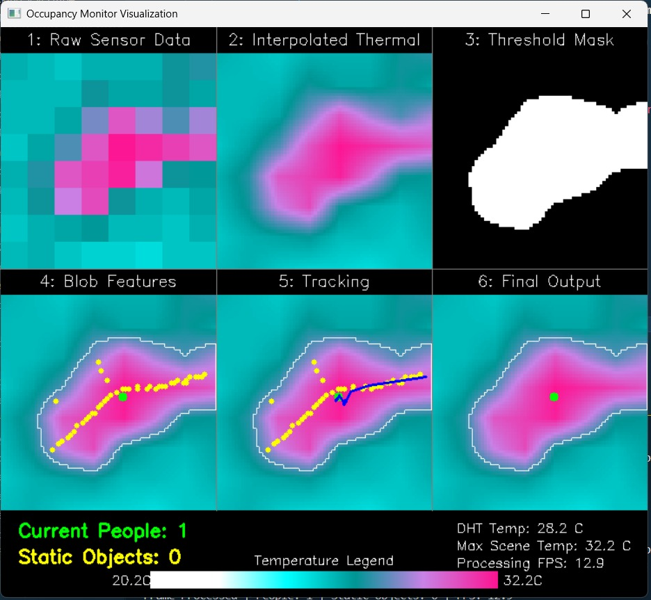
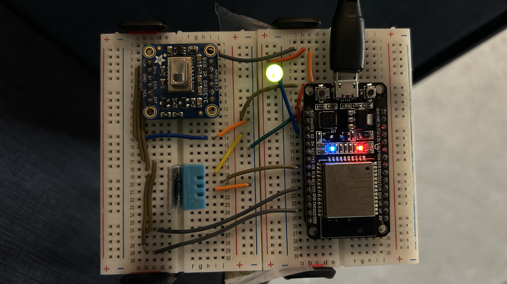
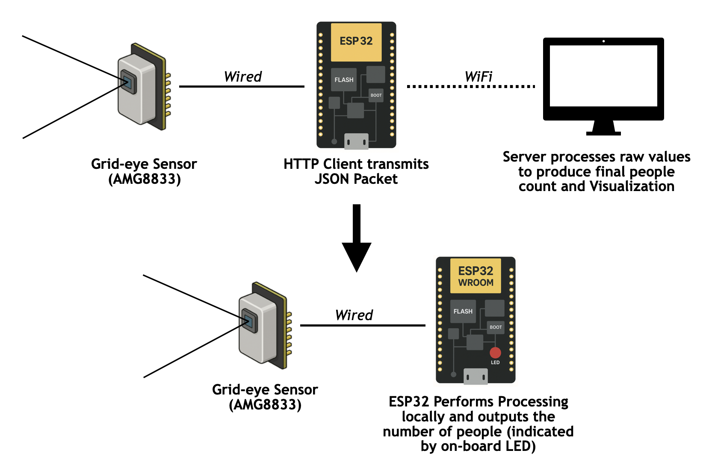

# Thermal Sensor-Based People Counting System

A real-time people counting system using thermal sensors (AMG8833 Grid-Eye) with embedded processing on ESP32 and visualization on a laptop. This project implements a two-stage system for enhanced privacy and real-time occupancy monitoring.

## 📋 Project Overview

This system uses an AMG8833 Grid-EYE thermal sensor to detect and count people in a room. The implementation features:

- **Privacy-focused processing**: Local computation on ESP32 with optional server visualization
- **Real-time tracking**: Multi-object tracking with blob detection and centroid matching
- **Static object suppression**: Automatic detection and masking of hot static objects
- **LED indicator**: On-device LED shows occupancy status
- **Data logging**: CSV export of sensor data and occupancy metrics
- **Visualization dashboard**: Real-time 6-panel visualization showing the complete algorithmic pipeline

## 🏗️ System Architecture

The project implements a two-stage development approach:

### Stage 1: Server-Dependent Configuration
- ESP32 sends raw sensor data to a Python server
- Server performs algorithm refinement and visualization
- Ideal for development and testing

### Stage 2: Embedded System (Final)
- Local processing on ESP32 for enhanced privacy
- Minimal data transmission
- Standalone operation with LED indicators

## 🖼️ Visual Documentation

### Algorithm Pipeline Visualization

*Visualization of the step-by-step algorithmic pipeline showing the 6-panel dashboard with real-time processing*

### Hardware Setup

*Complete hardware setup showing ESP32, AMG8833 sensor, and DHT11 sensor connections*

### Masking Feature Implementation


*Snapshot demonstrating the masking feature implementation for static object suppression*

### System Architecture

*Two-stage system development diagram showing server-dependent configuration and final embedded system*

## 📊 Dataset

The project includes a comprehensive dataset recorded in a **confined study pod environment** with dimensions **2.20m × 1.05m × 2.10m**. The dataset contains recordings for different occupancy scenarios:

### Dataset Structure
- **`0 persons/`**: Empty room baseline recordings
- **`1 person -Trial_1/`**: Single person recordings (First trial)
- **`1 person - Trial_2/`**: Single person recordings (Second trial)
- **`2 persons/`**: Two person recordings

### Data Types
Each scenario folder contains:
- **`tracking_images/`**: Real-time tracking visualizations showing the 6-panel dashboard
- **`final_output_images/`**: Final processed outputs with people detection and counting
- **`csv_data/`**: Raw sensor data, timestamps, and occupancy metrics

### Study Environment
- **Location**: Confined study pod
- **Dimensions**: 2.20m × 1.05m × 2.10m (Length × Width × Height)
- **Purpose**: Controlled environment testing for algorithm validation
- **Coverage**: Multiple trials to ensure system reliability and accuracy

## 🔧 Hardware Requirements

### Components
- **ESP32 Development Board**
- **AMG8833 Grid-EYE Thermal Sensor** (8×8 thermal array)
- **DHT11 Temperature & Humidity Sensor**
- **LED** (for occupancy indication)
- **Breadboard and jumper wires**
- **USB cable** for ESP32 programming

### Connections
```
ESP32 Pin Connections:
- GPIO 21 (SDA) → AMG8833 SDA
- GPIO 22 (SCL) → AMG8833 SCL
- GPIO 5 → DHT11 Data
- GPIO 2 → LED (with appropriate resistor)
- 3.3V → AMG8833 VCC, DHT11 VCC
- GND → AMG8833 GND, DHT11 GND
```

## 📁 Project Structure

```
DYU_labs/
├── esp32-code/
│   └── final-code.ino          # ESP32 Arduino code
├── main.py                     # Python server and visualization
├── dataset/                    # Recorded dataset from confined study pod
│   ├── 0 persons/             # Empty room recordings
│   │   ├── tracking_images/   # Real-time tracking visualizations
│   │   ├── final_output_images/ # Final processed outputs
│   │   └── csv_data/          # Sensor data and metrics
│   ├── 1 person -Trial_1/     # Single person recordings (Trial 1)
│   │   ├── tracking_images/   # Real-time tracking visualizations
│   │   ├── final_output_images/ # Final processed outputs
│   │   └── csv_data/          # Sensor data and metrics
│   ├── 1 person - Trial_2/    # Single person recordings (Trial 2)
│   │   ├── tracking_images/   # Real-time tracking visualizations
│   │   ├── final_output_images/ # Final processed outputs
│   │   └── csv_data/          # Sensor data and metrics
│   └── 2 persons/             # Two person recordings
│       ├── tracking_images/   # Real-time tracking visualizations
│       ├── final_output_images/ # Final processed outputs
│       └── csv_data/          # Sensor data and metrics
├── hardware-setup.jpg          # Hardware setup image
├── image-mask.png             # Masking feature snapshot
├── methodology-architecture.png # System architecture diagram
├── output-visualization.jpeg   # Algorithm pipeline visualization
└── README.md                   # This file
```

## 🚀 Setup Instructions

### 1. ESP32 Setup

#### Prerequisites
- Arduino IDE with ESP32 board support
- Required libraries:
  - `Wire` (built-in)
  - `WiFi` (built-in)
  - `Adafruit_AMG88xx` (install via Library Manager)
  - `DHT sensor library` (install via Library Manager)
  - `ArduinoJson` (install via Library Manager)

#### Configuration Steps
1. **Update WiFi Credentials** in `esp32-code/final-code.ino`:
   ```cpp
   const char* ssid = "YOUR_WIFI_SSID";
   const char* password = "YOUR_WIFI_PASSWORD";
   ```

2. **Update Server Details**:
   ```cpp
   const char* serverIP = "YOUR_LAPTOP_IP_ADDRESS";
   const int serverPort = 5000;
   ```

3. **Upload Code**:
   - Connect ESP32 to computer
   - Select correct board and port in Arduino IDE
   - Upload `final-code.ino`

### 2. Python Server Setup

#### Prerequisites
- Python 3.7+
- Required packages (install via pip):
  ```bash
  pip install opencv-python numpy flask gevent
  ```

#### Configuration Steps
1. **Ensure ESP32 and laptop are on the same WiFi network**

2. **Find your laptop's IP address**:
   - Windows: `ipconfig` in Command Prompt
   - Linux/Mac: `ifconfig` or `ip addr` in Terminal
   - Use this IP in the ESP32 code's `serverIP` variable

3. **Run the Python server**:
   ```bash
   python main.py
   ```

### 3. System Operation

1. **Power up ESP32** - LED will indicate connection status
2. **Start Python server** - Visualization window will open
3. **Monitor real-time data** - The 6-panel dashboard shows:
   - Raw 8×8 sensor data
   - 71×71 interpolated thermal image
   - Binary threshold mask
   - Extracted blob features with boundaries and central points
   - Tracked centroids and paths
   - Final processed output with hot object suppression

## 📊 Algorithm Pipeline

The system implements a sophisticated multi-stage processing pipeline:

### 1. Data Acquisition
- **AMG8833**: 8×8 thermal grid (64 pixels)
- **DHT11**: Ambient temperature for threshold calibration
- **Interpolation**: 8×8 → 71×71 using bilinear interpolation

### 2. Preprocessing
- **Thresholding**: Binary mask using (DHT temperature + 0.1°C)
- **Connected Components**: Blob detection and labeling

### 3. Feature Extraction
- **Centroid Calculation**: Average position of blob pixels
- **Distance Transform**: Manhattan distance for central point detection
- **Central Points**: Maximum distance points within blobs

### 4. Multi-Object Tracking
- **Centroid Matching**: Manhattan distance threshold (25 pixels)
- **Jaccard Index**: Central point similarity for robust matching
- **Virtual Propagation**: Handle temporary occlusions

### 5. Static Object Suppression
- **Persistence Detection**: Objects static for 20+ frames
- **Movement Threshold**: 0.8 pixel maximum movement
- **Mask Generation**: Circular masks for persistent objects
- **Hot Object Suppression**: Replace persistent regions with baseline temperature

## 💡 LED Indicator System

The ESP32 includes an on-device LED indicator:
- **LED ON**: At least one person detected in the room
- **LED OFF**: No people detected (room is empty)

This provides immediate visual feedback without requiring the visualization dashboard.

## 📈 Data Logging

The system automatically logs data to CSV files:
- **Auto-incrementing filenames**: `data_1.csv`, `data_2.csv`, etc.
- **Timestamped entries**: ISO format timestamps
- **Complete sensor data**: 8×8 thermal grid values
- **Occupancy metrics**: People count and static object count
- **Environmental data**: DHT temperature and humidity

### Dataset Collection
The included dataset was collected in a controlled confined study pod environment:
- **Environment**: 2.20m × 1.05m × 2.10m study pod
- **Scenarios**: 0, 1, and 2 person occupancy
- **Trials**: Multiple trials for single-person scenarios
- **Data Types**: Images, CSV files, and tracking visualizations
- **Validation**: Comprehensive testing for algorithm accuracy and reliability

## ⚙️ Tunable Parameters

### ESP32 Parameters (`final-code.ino`)
```cpp
const int MATCH_THRESHOLD = 25;           // Centroid matching threshold
const int BOUNDARY = 35;                  // Crossing boundary row
const int OBJECT_STATIC_FRAME_THRESHOLD = 20;  // Frames for persistence
const float MAX_MOVEMENT_THRESHOLD = 0.8;      // Max movement for static objects
const unsigned long DHT_INTERVAL = 10000;      // DHT update interval (ms)
```

### Python Parameters (`main.py`)
```python
MATCH_THRESHOLD_CENTROID = 25      # Centroid matching threshold
CENTRAL_POINT_DIST_THRESHOLD = 7   # Central point distance threshold
JACCARD_THRESHOLD_CP = 0.25        # Jaccard index threshold
```

## 🔍 Troubleshooting

### Common Issues

1. **ESP32 won't connect to WiFi**
   - Verify SSID and password are correct
   - Check WiFi network availability
   - Ensure ESP32 has sufficient power

2. **No data received by Python server**
   - Verify both devices are on same WiFi network
   - Check firewall settings on laptop
   - Confirm correct IP address in ESP32 code

3. **Poor detection accuracy**
   - Adjust `MATCH_THRESHOLD` values
   - Check sensor positioning and mounting
   - Verify ambient temperature calibration
   - Reference the dataset for expected performance in similar environments

4. **High false positives from static objects**
   - Increase `OBJECT_STATIC_FRAME_THRESHOLD`
   - Adjust `MAX_MOVEMENT_THRESHOLD`
   - Check for heat sources near sensor

### Dataset Validation
- **Compare Results**: Use the provided dataset to validate system performance
- **Environment Matching**: Ensure your setup matches the 2.20m × 1.05m × 2.10m study pod dimensions
- **Baseline Testing**: Start with 0-person scenario to establish baseline
- **Progressive Testing**: Test with 1-person, then 2-person scenarios

### Performance Optimization

- **Processing Speed**: Adjust `delay(50)` in ESP32 loop
- **Memory Usage**: Monitor heap fragmentation on ESP32
- **Network Latency**: Optimize WiFi signal strength
- **Visualization FPS**: Adjust `cv2.waitKey(50)` in Python code

## 📝 Authors

1. [Nishant V H](https://github.com/NishantHegde2305)
2. [Suhas Papanashi](https://github.com/suhas-333)  
3. [Manojith Bhat](https://github.com/ManojithBhat)

## 📄 License

This project is developed for educational and research purposes.

## 🤝 Contributing

Feel free to submit issues and enhancement requests. For major changes, please open an issue first to discuss what you would like to change.

---

**Note**: This system is designed for privacy-conscious applications where local processing is preferred over cloud-based solutions. The ESP32 implementation provides standalone operation while the Python server enables detailed analysis and visualization during development. 
